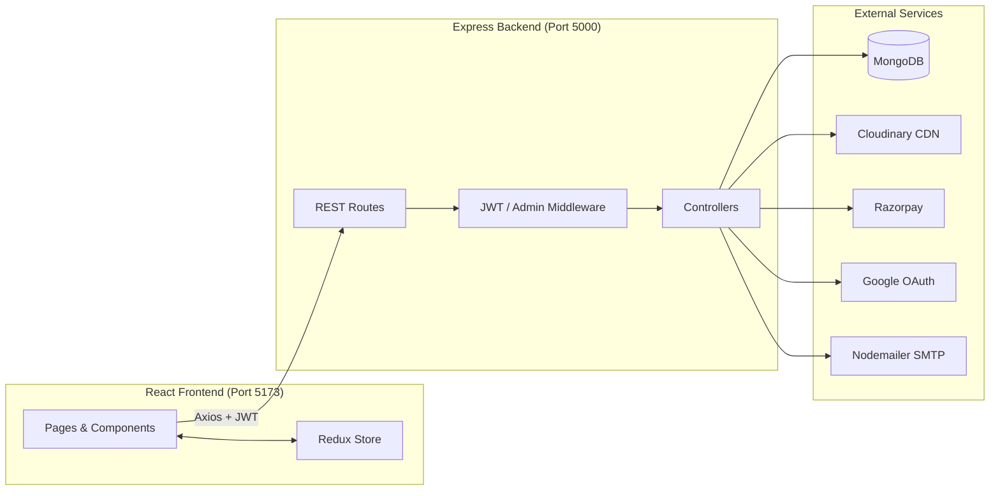
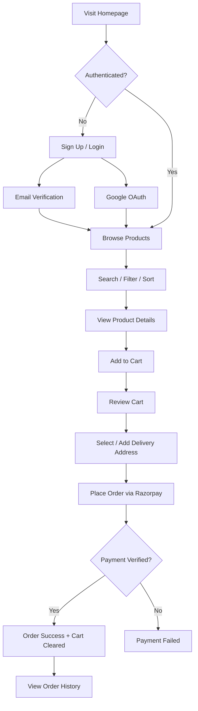
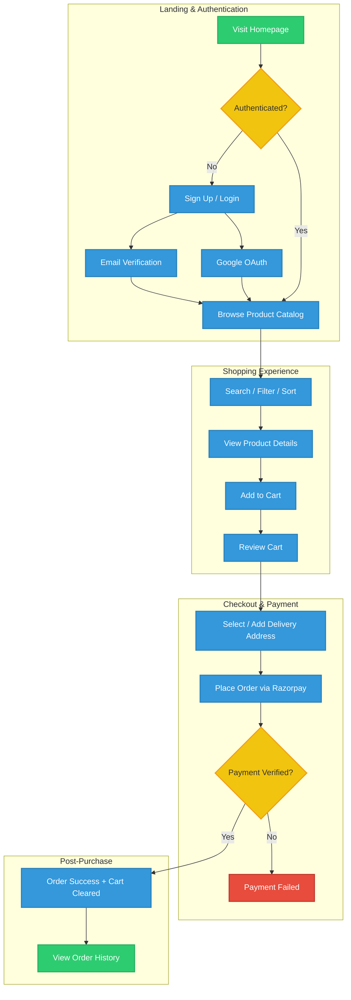
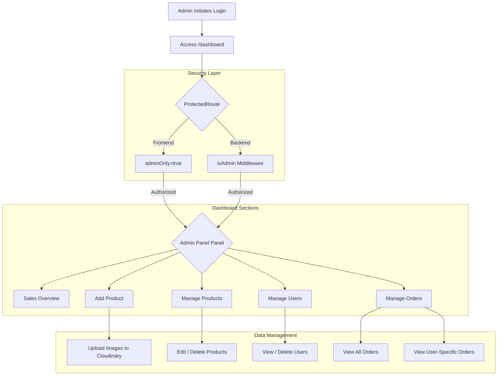
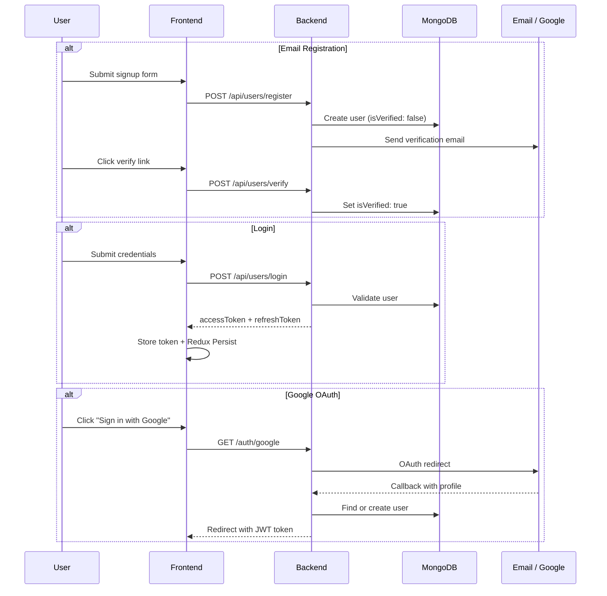
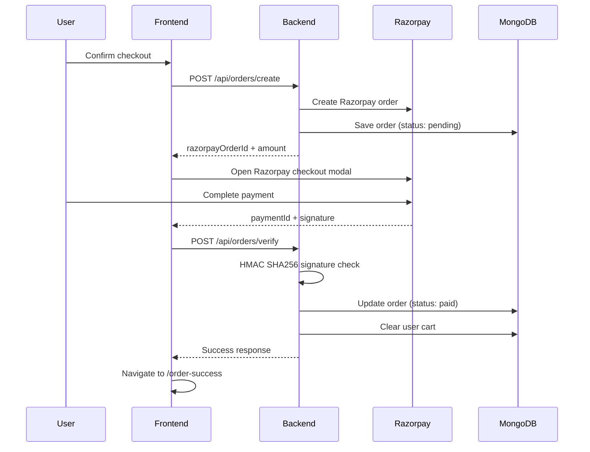

# 🛋️ Durable Sofa — Full-Stack E-Commerce Platform

A modern, production-style furniture e-commerce web application built with the **MERN stack**. Durable Sofa lets customers browse premium furniture (sofas, headboards, pillows, mattresses), manage carts, checkout with **Razorpay**, and track orders — while admins manage inventory, users, and sales from a dedicated dashboard.

> Built to demonstrate end-to-end full-stack engineering: REST API design, JWT authentication, OAuth 2.0, payment gateway integration, cloud media storage, and a responsive React SPA with global state management.

---

## 📋 Table of Contents

- [Features](#-features)
- [Tech Stack](#-tech-stack)
- [Application Workflow](#-application-workflow)
- [Project Structure](#-project-structure)
- [API Overview](#-api-overview)
- [Environment Variables](#-environment-variables)
- [Getting Started](#-getting-started)
- [Screens & Routes](#-screens--routes)
- [Architecture Highlights](#-architecture-highlights)

---

## ✨ Features

### Customer Experience
| Feature | Description |
|---------|-------------|
| **Product Catalog** | Browse, search, filter by category & price, and sort products |
| **Product Details** | Image gallery with zoom, technical specs, and add-to-cart |
| **Shopping Cart** | Persistent cart with quantity updates and item removal |
| **Multi-Address Checkout** | Add, edit, delete, and select delivery addresses |
| **Razorpay Payments** | Secure order creation, payment verification, and order confirmation |
| **Order History** | View past orders and payment status |
| **User Profile** | Update profile, upload profile picture (Cloudinary) |

### Authentication & Security
| Feature | Description |
|---------|-------------|
| **Email/Password Auth** | Registration with email verification (Handlebars + Nodemailer) |
| **Google OAuth 2.0** | One-click sign-in via Passport.js |
| **Forgot Password** | OTP-based password reset flow |
| **JWT Protection** | Bearer token middleware on protected routes |
| **Role-Based Access** | Separate user and admin roles with route guards |

### Admin Dashboard
| Feature | Description |
|---------|-------------|
| **Product Management** | CRUD operations with multi-image upload to Cloudinary |
| **User Management** | View all users, delete accounts |
| **Order Management** | View all orders and per-user order history |
| **Sales Dashboard** | Admin analytics overview (extensible) |

---

## 🛠 Tech Stack

### Frontend
| Technology | Purpose |
|------------|---------|
| **React 19** | UI library |
| **Vite 7** | Build tool & dev server |
| **React Router v7** | Client-side routing |
| **Redux Toolkit + Redux Persist** | Global state (user, cart, products, addresses) |
| **Tailwind CSS v4** | Utility-first styling |
| **Radix UI + shadcn/ui** | Accessible, composable UI components |
| **Framer Motion** | Page & component animations |
| **Axios** | HTTP client for API calls |
| **Sonner** | Toast notifications |

### Backend
| Technology | Purpose |
|------------|---------|
| **Node.js + Express 5** | REST API server |
| **MongoDB + Mongoose** | Database & ODM |
| **JWT + bcryptjs** | Authentication & password hashing |
| **Passport.js (Google OAuth)** | Social login |
| **Razorpay** | Payment gateway |
| **Cloudinary** | Image storage & CDN |
| **Multer** | File upload handling |
| **Nodemailer + Handlebars** | Transactional emails & OTP |

---

## 🔄 Application Workflow

### High-Level System Flow



## Customer Journey


### 📋 E-Commerce Application Architecture

Below are the visual flowcharts for both the User and Admin workflows. Copy and paste this entire block into your `README.md` file.

#### 👤 1. User Journey Flowchart



#### 👑 2. Admin Panel & Middleware Flowchart



### 1. Authentication & Identity Flow


### 2. Checkout & Payment Flow (Razorpay Integration)


---

## 📁 Directory Architecture

```text
Durable-Sofa/
├── Frontend/                    # React SPA (Vite)
│   ├── index.html               # App entry HTML
│   ├── vite.config.js           # Vite configuration
│   ├── components.json          # shadcn/ui config
│   ├── eslint.config.js
│   ├── package.json
│   └── src/
│       ├── main.jsx             # React root + Redux Provider
│       ├── App.jsx              # React Router configuration
│       ├── index.css            # Global styles (Tailwind)
│       ├── config.js            # Centralized API_URL config
│       ├── pages/               # Route-level page components
│       │   ├── Home.jsx         # Landing page
│       │   ├── Login.jsx
│       │   ├── Signup.jsx
│       │   ├── AuthSuccess.jsx  # OAuth callback handler
│       │   ├── EmailVerify.jsx
│       │   ├── ForgotPassword.jsx
│       │   ├── VerifyOtp.jsx
│       │   ├── ChangePassword.jsx
│       │   ├── Products.jsx     # Product catalog
│       │   ├── ProductDetails.jsx 
│       │   ├── Cart.jsx
│       │   ├── AddressForm.jsx  # Checkout & address management
│       │   ├── OrderSuccess.jsx
│       │   ├── Orders.jsx       # Order history
│       │   ├── Profile.jsx
│       │   ├── Dashboard.jsx    # Admin layout shell
│       │   ├── NotFound.jsx
│       │   └── admin/           # Admin-only pages
│       │       ├── AddProduct.jsx
│       │       ├── AdminProducts.jsx
│       │       ├── AdminUsers.jsx
│       │       ├── AdminOrders.jsx
│       │       ├── AdminSales.jsx
│       │       └── ShowUserOrders.jsx
│       ├── components/          # Reusable UI components
│       │   ├── Navbar.jsx
│       │   ├── Footer.jsx
│       │   ├── Hero.jsx
│       │   ├── CategoryMarquee.jsx
│       │   ├── WhyChooseUs.jsx
│       │   ├── ProductCard.jsx
│       │   ├── ProductSearch.jsx
│       │   ├── ProductFilter.jsx
│       │   ├── FiltersSideBar.jsx
│       │   ├── CartCard.jsx
│       │   ├── TechnicalSpecs.jsx
│       │   ├── AdminSidebar.jsx
│       │   ├── AdminProductDetails.jsx
│       │   ├── ProtectedRoute.jsx # Auth & role guard
│       │   └── ui/              # shadcn/ui primitives
│       │       ├── button.jsx | input.jsx | card.jsx | dialog.jsx
│       │       └── select.jsx | badge.jsx | accordion.jsx | sonner.jsx
│       ├── redux/               # Global state management
│       │   ├── store.js         # Redux store + persist config
│       │   ├── userSlice.js     # Auth & user profile state
│       │   ├── cartSlice.js     # Shopping cart state
│       │   ├── productSlice.js  # Product catalog cache
│       │   └── addressSlice.js  # Delivery addresses state
│       └── lib/
│           └── utils.js         # Tailwind class merge utility (cn)
│
└── Backend/                     # Express REST API
    ├── server.js                # Express app entry point
    ├── package.json
    ├── config/
    │   ├── passport.js          # Google OAuth strategy
    │   └── razorpay.js          # Razorpay instance config
    ├── Database/
    │   └── db.js                # MongoDB connection (Mongoose)
    ├── Models/                  # Mongoose schemas
    │   ├── userModel.js         # User (roles, auth, profile)
    │   ├── productModel.js      # Products (categories, images, specs)
    │   ├── cartModel.js         # User shopping carts
    │   ├── addressModel.js      # Delivery addresses
    │   ├── orderModel.js        # Orders + Razorpay metadata
    │   └── sessionModel.js
    ├── Controllers/             # Business logic layer
    │   ├── userController.js    # Auth, profile, OTP, admin user ops
    │   ├── productController.js # Product CRUD + Cloudinary upload
    │   ├── cartController.js    # Cart add/update/remove
    │   ├── addressController.js # Address CRUD
    │   └── orderController.js   # Order creation + payment verify
    ├── Routes/                  # API route definitions
    │   ├── authRoute.js         # Google OAuth + /auth/me
    │   ├── userRoute.js         # /api/users/*
    │   ├── productRoute.js      # /api/products/*
    │   ├── cartRoute.js         # /api/cart/*
    │   ├── addressRoute.js      # /api/address/*
    │   └── orderRoute.js        # /api/orders/*
    ├── middleware/
    │   ├── isAuthenticated.js   # JWT verification + isAdmin guard
    │   └── multer.js            # Single & multi-file upload config
    ├── utils/
    │   ├── cloudinary.js        # Cloudinary SDK setup
    │   └── dataUri.js           # File buffer → Data URI converter
    └── emailVerify/
        ├── verifyMail.js        # Email verification templates
        ├── sendOtp.js           # OTP email sender
        └── template.hbs         # Handlebars email template
```

---

## 🔌 API Endpoint Specification

| Method | Endpoint | Auth Level | Description |
| :--- | :--- | :--- | :--- |
| **Auth** | | | |
| `GET` | `/auth/google` | Public | Initiate Google OAuth session |
| `GET` | `/auth/google/callback` | Public | Google OAuth callback + JWT redirection |
| `GET` | `/auth/me` | Valid JWT | Fetch current authenticated context |
| **Users** | | | |
| `POST` | `/api/users/register` | Public | Register new user account |
| `POST` | `/api/users/verify` | Public | Verify activation token from email |
| `POST` | `/api/users/login` | Public | Verify credentials and return active tokens |
| `POST` | `/api/users/logout` | Valid JWT | Annul active session tokens |
| `POST` | `/api/users/forgotpassword`| Public | Dispatch password reset OTP to email |
| `POST` | `/api/users/verifyotp/:email`| Public | Authenticate password token validation |
| `POST` | `/api/users/changepassword/:email`| Public | Write new password to backend record |
| `GET` | `/api/users/allusers` | Admin Only | Return list of every system user profile |
| `PUT` | `/api/users/updateprofile/:userId`| Valid JWT | Update basic user profile metadata + avatar |
| **Products** | | | |
| `GET` | `/api/products/get-products`| Public | View whole catalog listing |
| `GET` | `/api/products/getProduct/:_id`| Public | Fetch explicit item specs by ID |
| `POST` | `/api/products/add` | Admin Only | Construct new listing with images |
| `PUT` | `/api/products/update-products/:productId`| Admin Only | Modify existing product details |
| `DELETE`| `/api/products/delete-products/:productId`| Admin Only | Remove designated item from system index |
| **Cart** | | | |
| `GET` | `/api/cart/get-cart` | Valid JWT | Access personalized item cart list |
| `POST` | `/api/cart/add-to-cart` | Valid JWT | Commit chosen product reference to cart |
| `PUT` | `/api/cart/update-quantity`| Valid JWT | Change numerical allocation count |
| `DELETE`| `/api/cart/remove-item` | Valid JWT | Excise targeted line item from active session |
| **Address** | | | |
| `POST` | `/api/address/add` | Valid JWT | Register new home or shipping profile |
| `GET` | `/api/address/getAllAddresses`| Valid JWT | Aggregate shipping options for current profile |
| `PUT` | `/api/address/update/:id` | Valid JWT | Edit specific location details |
| `DELETE`| `/api/address/delete/:id` | Valid JWT | Purge entry from profile address book |
| **Orders** | | | |
| `POST` | `/api/orders/create` | Valid JWT | Formulate backend order metadata + call Razorpay |
| `POST` | `/api/orders/verify` | Valid JWT | Verify SHA256 receipt key signature details |
| `GET` | `/api/orders/my-orders` | Valid JWT | Fetch user-specific historical receipts |
| `GET` | `/api/orders/all-orders` | Admin Only | Extract macro overview of all transactions |
| `GET` | `/api/orders/user-orders/:userId`| Admin Only | Drill down into purchases by unique ID |
